# Design and Architecture of _Chirp!_

## Domain model
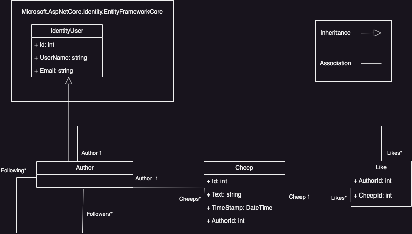

The domain model that represents our Chirp! application is shown in the given diagram. As pictured there are three main concepts; Author, Cheep and Like. 

### Like
Like holds an Author- and CheepId as well as the Author that liked the Cheep and which Cheep was liked. 

### Cheep
The Cheep consists of an Id, a Timestamp, an AuthorId and it holds the message that is posted to the Chirp! application. Furthermore, it takes an Author and a number of Likes. Here it is vital that a Cheep can only have one Author, but have many Likes from different users of Chirp!. 

### Author
Author represents the user of Chirp!. The Author consists of the Cheeps they have written, the Likes they have given and lists of Followers and Following. The lists either represent other Authors the user follows, or Authors that follow the user. 
Author inherits from IdentityUser, which is a part of ASP.NET Core Identity. IdentityUser holds different fields that Author uses; Id, UserName and Email. 

### ASP.NET Core Identity
Chirp uses ASP.NET Core Identity for the login functionality and management of the users of Chirp!. It also supports authentication and authorization. In this Chirp!-implementation GitHub is used as a third party to log-in. GitHub checks the username and password then authenticates to an existing GitHub-user. 
([See ASP.NET Core Identity documentation](https://learn.microsoft.com/en-us/aspnet/core/security/authentication/identity?view=aspnetcore-8.0&tabs=visual-studio))

We chose to use ASP.NET Core Identity because, while there is some auto-generated code it gives freedom to shape the code to fit our needs. This was prevalent e.g. when making the Author, because while we extended IdentityUser, we were also able to customize our Author-type to fit the needs of Chirp!. ([See ASP.NET Core Identity customization documentation](https://learn.microsoft.com/en-us/aspnet/core/security/authentication/customize-identity-model?view=aspnetcore-8.0))


## Architecture — In the small

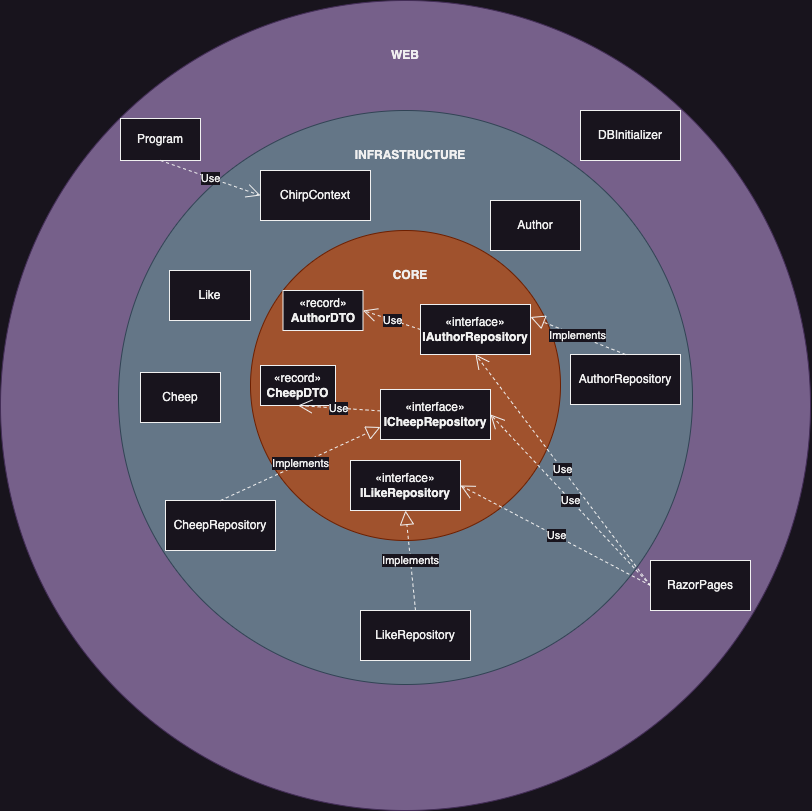

The given diagram represents our Chirp!-architecture, which follows an Onion Architecture. This architecture satisfies that all layers depend inward. The layers are divided into ‘Core’,  ‘Infrastructure’ and ‘Web’. Each of our classes are represented in their given layer, according to their functionality in the program. 

The ‘Core’ layer reflects our application logic, and holds the repository interfaces and DTO’s (Data Transfer Objects).

The  ‘Infrastructure’ layer follows the business rules set in our Core-layer. It holds our data models such as ‘Like’, ‘Cheep’ and ‘Author’, with implementations of their given repositories. The repositories contain logic of how our data models behave with each other and according to the user input. 

The ‘Web’ layer reflects the framework of the Chirp! Application, and hereby holds Program.cs, Razor Pages and DBInitializer.


## Architecture of deployed application

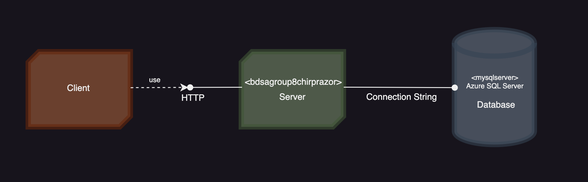

The illustration displays that we are using a client/server architecture in our program, with the Azure App Server connecting to an Azure SQL Server Database. Both servers are hosted by Azure.


## User activities
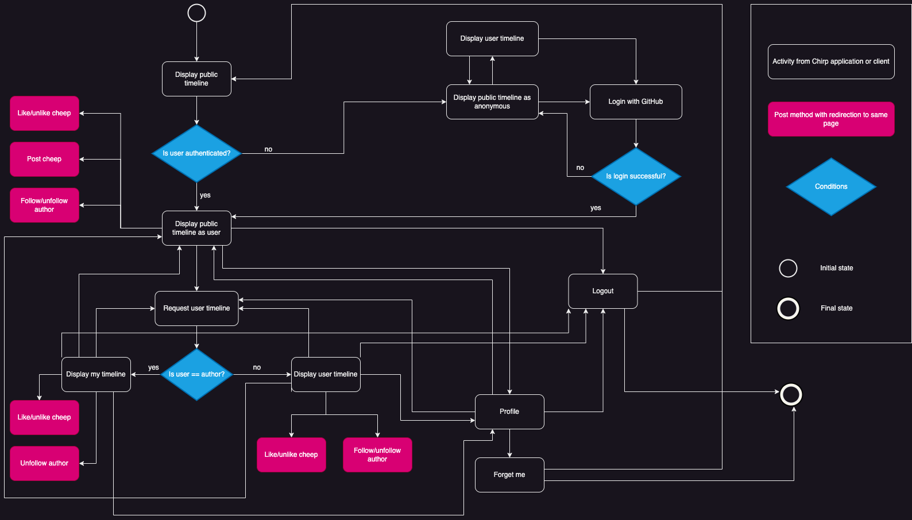

The activity diagram illustrates how a user can journey through our Chirp! application. It shows what an anonymous user can do within the application, where they can navigate to three different pages. The unauthenticated user can only view Cheeps. 

 If the user is logged in, they can see a public timeline, a user timeline for another user or their own timeline. The user can like and unlike cheeps from all mentioned pages, as well as follow and unfollow other users. But it is only from the public timeline that a user can post a cheep. 

The user can end the journey by ‘Forget me’ from the Profile page or anytime by the Logout page. 


## Sequence of functionality/calls through _Chirp!_

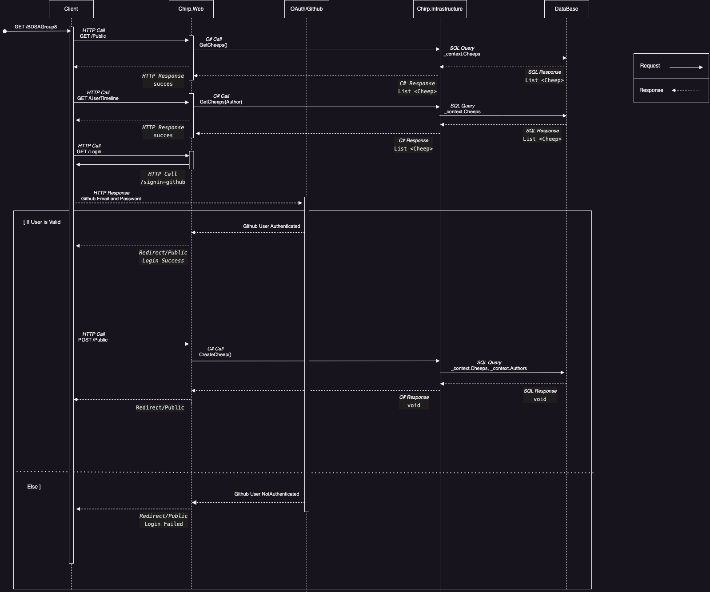


The sequence diagram illustrates different calls through our Chirp! application. There are 4 lifelines: ‘Client’, ‘Chirp.Web’, ‘Chirp.Infrastructure’ and ‘Database’. 

The client can send HTTP calls to Chirp.Web which then, on behalf of the HTTP call, makes a C# call to Chirp.Infrastructure. 

Infrastructure is able to communicate with the database through SQL queries which then generates the response to the client. This shows how the different subsystems of our program communicate with each other based on the calls from the client. 

Notice the client is not authenticated at the beginning of the sequence but there will still be sent a HTTP get request to get all cheeps from the database as these are visible even for an unauthorized user. 

The diagram illustrates the process of getting authenticated by Github. The authentication in Oauth with GitHub sequence is not shown in the diagram. But in short, Chirp! uses Oauth/Github to authenticate users via the GitHub API. 

# Process

## Build, test, release, and deployment

### Build and Test
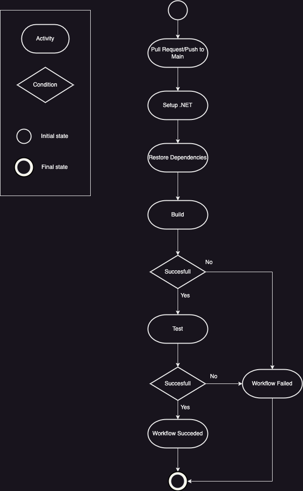

When making a pull request or pushing to main, Github Actions gets triggered to execute the workflow ‘build_and_test.yml’. This is done to make sure that the new changes made don’t interfere with the ability to build and test our program. 

It is worth noticing that we had to filter out our integration test from the 'build_and_test.yml' workflow by adding the command: `dotnet test --filter FullyQualifiedName\!~IntegrationTest --no-build`. This is because the tests fail, due to the WebApplicationFactory, as we don't have the connection string when running the workflow in GitHub. 


### Build and Deploy
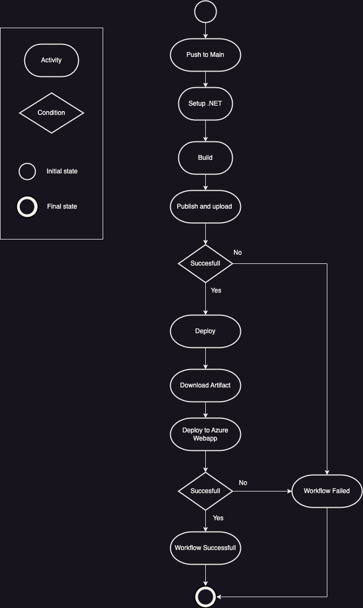

When pushing to main, Github Actions gets triggered to execute the workflow ‘main_bdsagroup8chirprazor.yml’. This builds and deploys our ASP.Net Core app to Azure Web App. 

This is done to make sure that our hosted application is always up to date. If the build is successful the workflow will start deploying. Here it will download the artifact from the build and deploy this to Azure.


### Publish
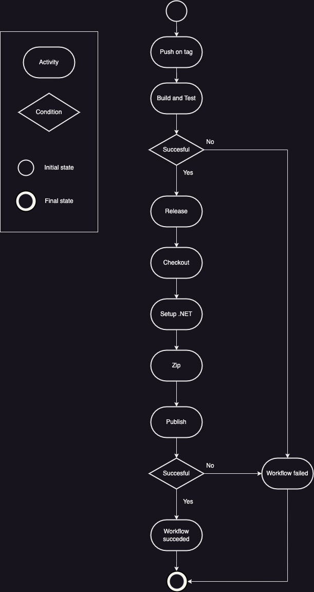

When pushing to main with a tag Github Actions gets triggered to execute the workflow ‘publish.yml’. The tag needs to be in the style “v.*.*.*” to run the workflow. The tag has been a point of contention throughout and has only worked in the end. Therefore we don’t have a long release history, because the releases have been under the ‘main’-tag. 

This workflow first builds and tests our program (as seen in Build and Test). And if this is successful, then it begins its release. We make a release for the 3 different operating systems in a matrix: “Linux”, “Windows” and “MacOS”. The workflow then makes a zipped version of Chirp!. 


## Team work

### Project board
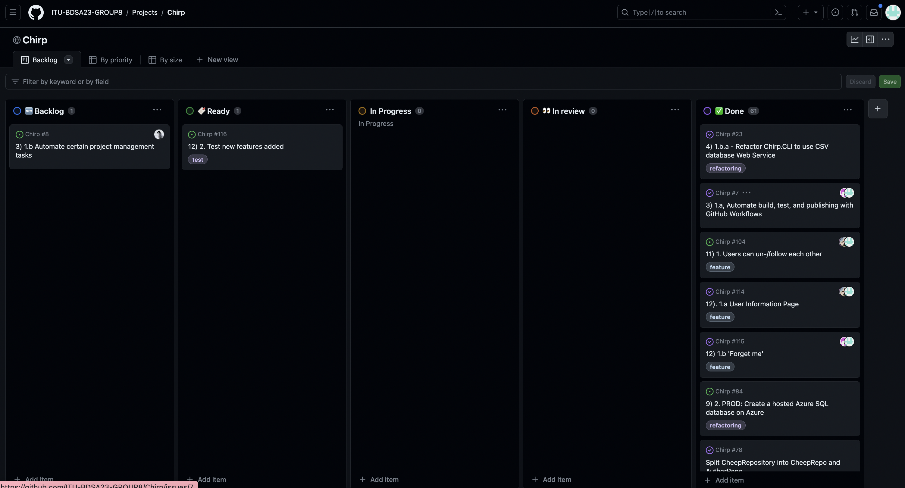
As seen in the project board most of the issues have been completed and closed. We have a few incomplete issues; Automation of project tasks and Test of new features. 

The automation of project tasks has been attempted in 'BoardAssignment.yml' in Chirp!. However it was never able to run properly and we decided to move the issue to the backlog and revisit if we had the time. It has not been a priority. 

The test-issue concerns the newly added features of the ‘Profile’-page and the ForgetMe feature. Due to time constraints these have not been tested either in a unit- or integration test. Therefore the issue stays in the ready-category. 

### Issues
The following activity diagram shows the road from issue to finalized merge into main. 

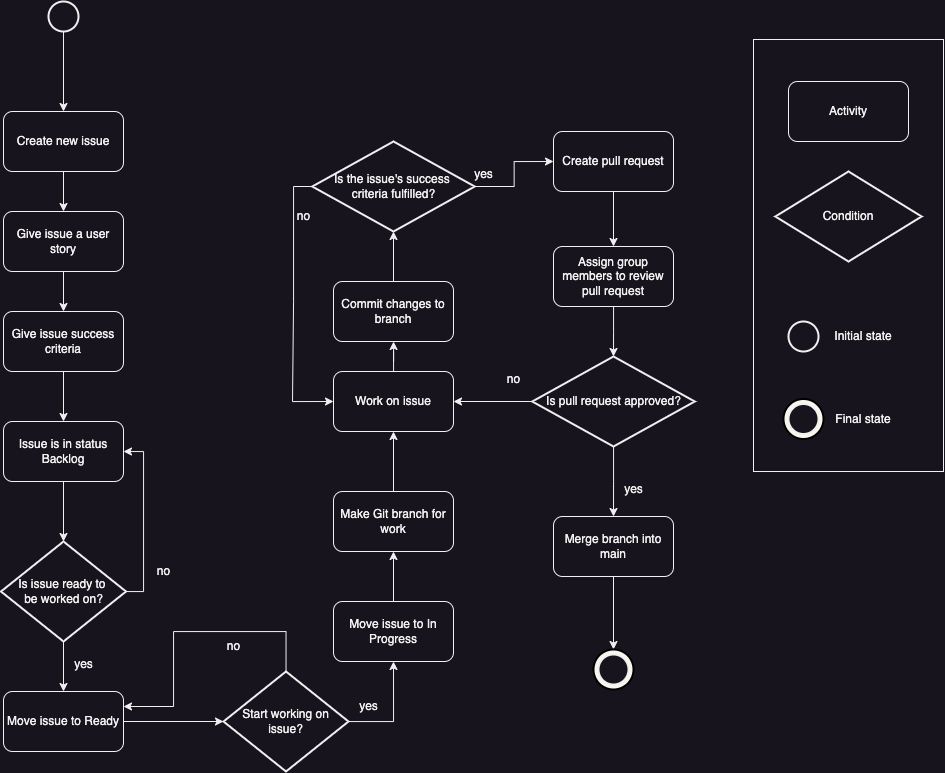


We start by creating the issue with the correct criteria for a proper and wellformulated issue, i.e. user story and success criteria. Then the issue is moved around the project board depending on its state. When the issue has been worked on and is ready to be committed to our main branch, a pull request will ask the different team members to review the commit and either approve, request changes or provide feedback. 

A consequence of creating a pull request is that GitHub runs our workflow 'Build and Test', as it is triggered by a pull request. This catches build or test failures before a group member gets the chance to merge into the main branch, which results in less bugs or other issues ending up in main. 

This means we’ve had an iterative approach to working on the issues, because we might change some design-elements, code or a test failed and we had to fix the issue. This is done continuously. 

When the commit is merged to main, the issue is closed and automatically moves to the ‘Done’-column in the project board. 

Because the automation of assigning issues to team members never fully worked, we have assigned them manually. Usually each issue has been worked on by two or more team members and has utilized pair-programming. 


## How to make _Chirp!_ work locally

***Software needed***: 
- VSCODE
- .NET 7.0
- Docker
- A browser that is *not* Google Chrome

<br>

**1. Cloning the project**
1. Go to the Github repository page for Group 8: 
     - https://github.com/ITU-BDSA23-GROUP8/Chirp
2. Press on the green button '*<> Code*'  and copy the HTTPS address
3. Open a new window in VSCODE
4. Press '*Clone Git Repository*' and paste in the address from **step 2**. 
5. Confirm you are able to see the folders; all the code -  including tests etc. 
6. In the /Chirp.Web folder, make a new file with the name: 

	*"appsettings.Development.json"*
7. In this file, paste the following: 
```

		{
			"DetailedErrors": true,
			"Logging": {
				"LogLevel": {
					"Default": "Information",
					"Microsoft.AspNetCore": "Warning"
				}
			},
			"ConnectionStrings": {
				"SqlServer": "Server=127.0.0.1,1433;Database=Master;User Id=SA 
				Password=<YourStrong@Passw0rd> ;TrustServerCertificate=True"
			},
			"AllowedHosts": "*"
		}	

```

		
<br>

**2. Starting the database**
1. Open the Docker Desktop program
2. Start a new terminal
3. To start the Database, enter the following into the terminal

       docker run -e "ACCEPT_EULA=Y" -e "MSSQL_SA_PASSWORD=<YourStrong@Passw0rd>" \
		-p 1433:1433 --name sql1 --hostname sql1 \ 
		-d \ 
		mcr.microsoft.com/mssql/server:2022-latest

<br>

**3. Setup GitHub OAuth app**
1. On GitHub create a OAuth app to localhost
2. Start terminal at /Chirp.Web folder
3. Enter the following in the terminal with clientId and clientSecret from GitHub:

``````
	dotnet user-secrets init
	dotnet user-secrets set "authentication:github:clientId" "<YOUR_CLIENTID>"
	dotnet user-secrets set "authentication:github:clientSecret" "<YOUR_CLIENTSECRET>"
``````


**4. Starting the server**
1. Start a new terminal from the /Chirp.Web folder 
2. To start the server on your local machine, type in the terminal: 

        dotnet run
3. In the terminal output, find the localhost link and copy the address: 


4. Open a new window in your browser (*not* Google Chrome) and paste in the address from **step 3**. 
		

**5. Expected Result**
1. You should arrive at the main page of the Chirp! Application 


## How to run test suite locally


Our test suite consists of 20 tests, of which are either unit-, integration- or end2end-tests. 3 of the 20 tests are made with Playwright. 

The **unit tests** mainly test that our SQL database and Chirp.Core work as expected and create the corresponding DTO's. 

The **integration tests** check the website displays the correct information, and that the client is on the correct page (Public timeline / Private timeline), with the relevant info for this page. 

The **end2end tests**, tests the program's overall functionality from start to end, including login and authorization. 

As a note, we are aware that the Playwright tests currently tests directly upon the PROD web app (meaning, test cheeps etc are actually publicized, although then deleted again in the tests). 
Ideally, one would have a seperate environment 'TEST', in which these end2end tests are actualized. 

***Software needed***: 
- VSCODE
- .NET 7.0
- Playwright

**1. Running the tests**
1. Confirm you have Playwright installed. 
2. Start a new terminal from the /Chirp folder 
3. To run the first part of the test suite (except for Playwright tests), type in the terminal: 
		
		dotnet test

4. **Expected result *1st Part*** should look like the following, with 18 passed tests: 

	

5. Now, open another terminal, from the /test/PlaywrightTests folder
6. To run the second part of the test suite (non-Playwright tests), type in terminal: 

		dotnet test

7. **Expected result *2nd Part*** should look like the following, with 3 passed tests. (NOTE: You may have to manually press green button 'Authorize' at one point during the testing): 

	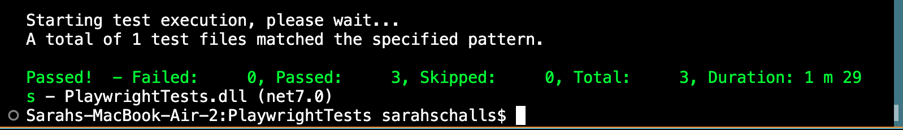

# Ethics

## License
We use an MIT License for software. We chose this license as it is very simple and permissive. It grants permission to modify, distribute, and for private and commercial use. As there is no warranty or liability, the copyright holders are not responsible for how the software is used. 

## LLMs, ChatGPT, CoPilot, and others
We did not make use of any LLMs in our project. 
