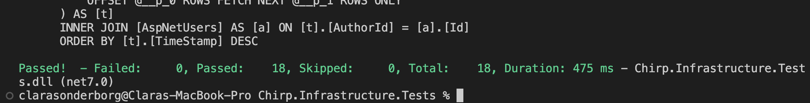

# Analysis, design and software architecture

## Introduction

## Design and architecture

### Domain model

Provide an illustration of your domain model.
Make sure that it is correct and complete.
In case you are using ASP.NET Identity, make sure to illustrate that accordingly.

### Architecture — In the small

Illustrate the organization of your code base.
That is, illustrate which layers exist in your (onion) architecture.
Make sure to illustrate which part of your code is residing in which layer.

### Architecture of deployed application

Illustrate the architecture of your deployed application.
Remember, you developed a client-server application.
Illustrate the server component and to where it is deployed, illustrate a client component, and show how these communicate with each other.

**OBS**: In case you ran out of credits for hosting an Azure SQL database and you switched back to deploying an application with in-process SQLite database, then do the following:

- Under this section, provide two diagrams, one that shows how _Chirp!_ was deployed with hosted database and one that shows how it is now again with SQLite.
- Under this section, provide a brief description of the reason for switching again to SQLite as database.
- In that description, provide a link to the commit hash in your GitHub repository that points to the latest version of your _Chirp!_ application with hosted database (we look at the entire history of your project, so we see that it was there at some point).

### User activities

Illustrate typical scenarios of a user journey through your _Chirp!_ application.
That is, start illustrating the first page that is presented to a non-authorized user, illustrate what a non-authorized user can do with your _Chirp!_ application, and finally illustrate what a user can do after authentication.

Make sure that the illustrations are in line with the actual behavior of your application.

### Sequence of functionality/calls trough _Chirp!_

With a UML sequence diagram, illustrate the flow of messages and data through your _Chirp!_ application.
Start with an HTTP request that is send by an unauthorized user to the root endpoint of your application and end with the completely rendered web-page that is returned to the user.

Make sure that your illustration is complete.
That is, likely for many of you there will be different kinds of "calls" and responses.
Some HTTP calls and responses, some calls and responses in C# and likely some more.
(Note the previous sentence is vague on purpose. I want that you create a complete illustration.)

## Process

### Build, test, release, and deployment

Illustrate with a UML activity diagram how your _Chirp!_ applications are build, tested, released, and deployed.
That is, illustrate the flow of activities in your respective GitHub Actions workflows.

Describe the illustration briefly, i.e., how your application is built, tested, released, and deployed.

### Team work

Show a screenshot of your project board right before hand-in.
Briefly describe which tasks are still unresolved, i.e., which features are missing from your applications or which functionality is incomplete.

Briefly describe and illustrate the flow of activities that happen from the new creation of an issue (task description), over development, etc. until a feature is finally merged into the `main` branch of your repository.

### How to make _Chirp!_ work locally

There has to be some documentation on how to come from cloning your project to a running system.
That is, Rasmus or Helge have to know precisely what to do in which order.
Likely, it is best to describe how we clone your project, which commands we have to execute, and what we are supposed to see then.

***Software needed***: 
- VSCODE
- .NET 7.0
- Docker
- A browser that is not Google Chrome

 

**1. Cloning the project**
1. Go to the Github repository page for Group 8: 
     - https://github.com/ITU-BDSA23-GROUP8/Chirp
2. Press on the green button '*<> Code*'  and copy the HTTPS address
3. Open a new window in VSCODE
4. Press '*Clone Git Repository*' and paste in the address from **step 2**. 
5. Confirm you are able to see the folders; all the code -  including tests etc. 
6. In the /Chirp.Web folder, make a new file with the name: 

	*"appsettings.Development.json"*
7. In this file, paste the following: 

		{
			"DetailedErrors": true,
			"Logging": {
				"LogLevel": {
					"Default": "Information",
					"Microsoft.AspNetCore": "Warning"
				}
			},
			"ConnectionStrings": {
				"SqlServer": "Server=127.0.0.1,1433;Database=Master;User Id=SA;Password=<YourStrong@Passw0rd> ;TrustServerCertificate=True"
			},
			"AllowedHosts": "*"
		}	

		
 

**2. Starting the database**
1. Open the Docker Desktop program
2. In VSCODE, start a new terminal from /Chirp folder 
3. To start the Database, enter all of the following into the terminal (can be done in one command): 

       docker run -e "ACCEPT_EULA=Y" -e "MSSQL_SA_PASSWORD=<YourStrong@Passw0rd>" \
		-p 1433:1433 --name sql1 --hostname sql1 \ 
		-d \ 
		mcr.microsoft.com/mssql/server:2022-latest

 

**3. Starting the server**
1. In VSCODE, start a new terminal from the /ChirpWeb folder 
2. To start the server on your local machine, type in the terminal: 

        dotnet run
3. In the terminal output, find the localhost link and copy the address: 
			
4. Open a new window in Firefox and paste in the address from **step 3**. 
		

**4. Expected Result**
1. You should arrive at the main page of the Chirp! Application 

### How to run test suite locally

List all necessary steps that Rasmus or Helge have to perform to execute your test suites.
Here, you can assume that we already cloned your repository in the step above.

Briefly describe what kinds of tests you have in your test suites and what they are testing.

Our test suite is completed of 20 tests, of which are either Unit-, Integration- or End to End-tests. 3 of the 20 tests are made with Playwright. 

The unit tests mainly test that our SQL database and Chirp.Core work as expected and create the corresponding object DTO's. 

The integration tests check the website has the correct information, and that the client is on the correct page (Public timeline / Private timeline), with the relevant info for this page. 

The end to end tests, tests the program's overall functionality from start to end, including login and authorization. 

***Software needed***: 
- VSCODE
- .NET 7.0
- Playwright

**1. Running the tests**
1. Confirm you have Playwright installed and open. 
2. In VSCODE, start a new terminal from the /Chirp folder 
3. To run the first part of the test suite (except from Playwright tests), type in the terminal: 
		
		dotnet test

4. **Expected result *1st Part* ** should look alike, with 17 passed tests.: 

	

5. Now, open a second terminal, from the /test/PlaywrightTests folder
6. To run the second part of the test suite (the Playwright tests), type in this terminal: 

		dotnet test

4. **Expected result *2nd Part*** should look alike, with 3 passed tests.: (OBS: You may have to manually press green button 'Authorize' at one point during the testing).

## Ethics
--

### License

State which software license you chose for your application.

--We use an MIT License. 

### LLMs, ChatGPT, CoPilot, and others

--We did not make use of any LLMs in our project. 

State which LLM(s) were used during development of your project.
In case you were not using any, just state so.
In case you were using an LLM to support your development, briefly describe when and how it was applied.
Reflect in writing to which degree the responses of the LLM were helpful.
Discuss briefly if application of LLMs sped up your development or if the contrary was the case.